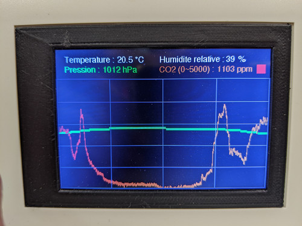

# capteur CO2 et pression atmosphérique
affichage des courbes de mesure sur 24h

# materiel
- Arduino Mega 2560
- Écran LCD pour Arduino Mega TFT 3,5’’, 480x320px, contrôleur ILI9486, 8 bits
- Capteur environnemental, COV Bosch Sensortec BME680
- Capteur de CO2 Winsen MH-Z19B, 0-5000ppm

Utilisation mémoire : 14% Flash / 36% RAM